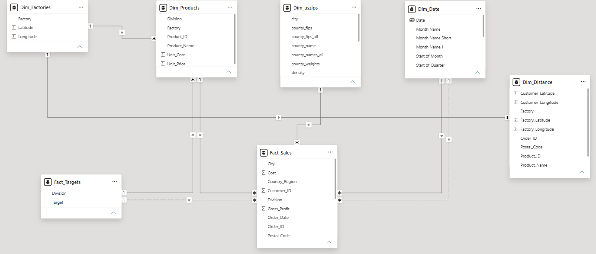
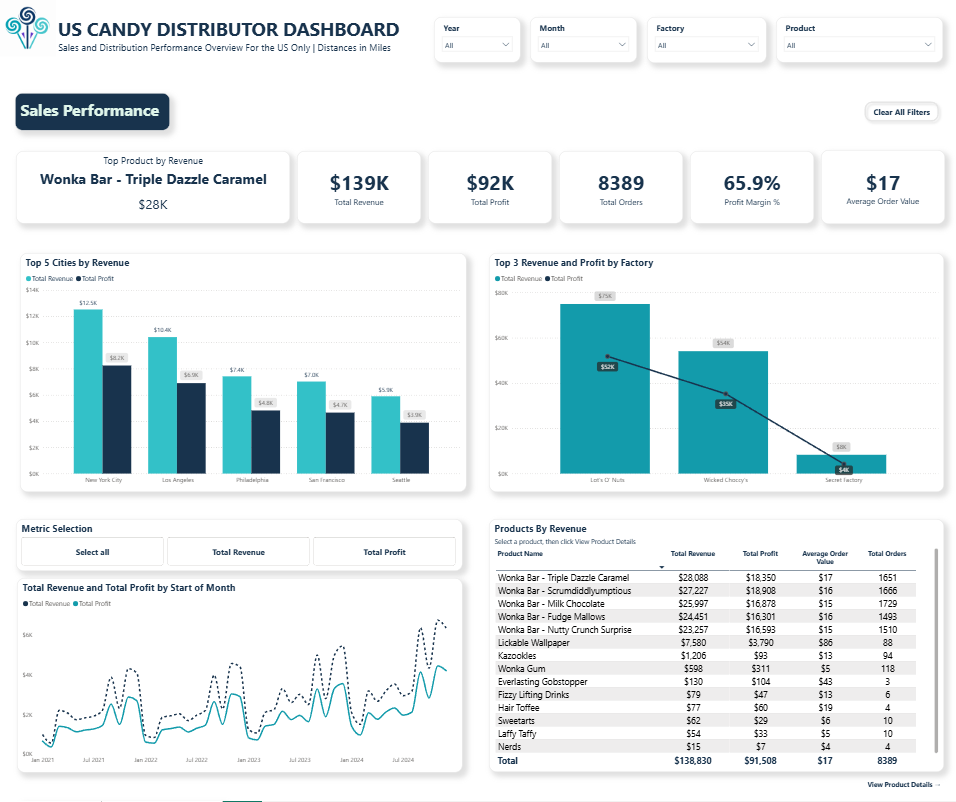
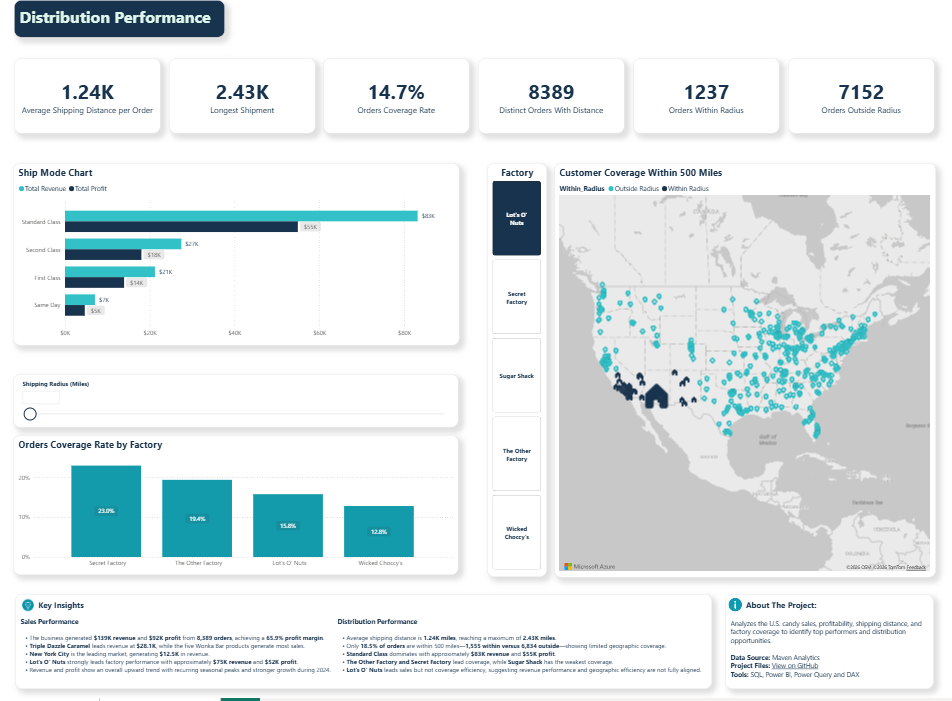
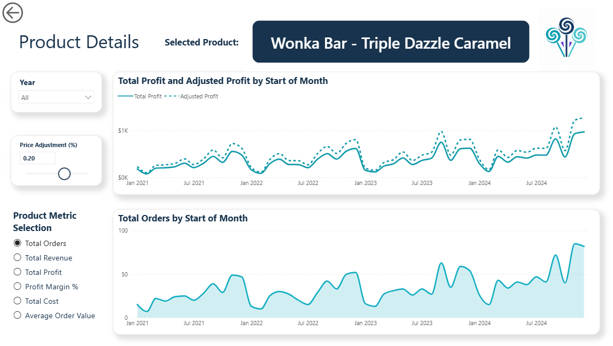

# Supply-Chain-Shipping-Dashboard
Analyzes the U.S. candy sales, profitability, shipping distance, and factory coverage to identify top performers and distribution opportunities.

#### 🚀 Live Dashboard

#### 👉 **[Click here to view the interactive Power BI Dashboard](<iframe title="Supply_Chain_Shipping_Project" width="600" height="373.5" src="https://app.powerbi.com/view?r=eyJrIjoiNjU5YmI2MTUtNzhjZC00MDU5LWJhZjUtYzRlZmJjYmEwM2YzIiwidCI6ImUzMThjNGEzLTQ4YzYtNGEyYS1iNjg1LTE4Yjc0MDFkYmU5MiJ9" frameborder="0" allowFullScreen="true"></iframe>)**

## 📖 Project Overview

This project is an end-to-end Business Intelligence solution developed in **Power BI** using the **Supply Chain Shipping** dataset provided by **Maven Analytics**.

The report transforms raw shipping and sales data into interactive dashboards that enable stakeholders to monitor sales performance, shipping operations, and product insights. It combines data preparation, data modeling, DAX calculations, and interactive visualizations to support data-driven business decisions and improve operational efficiency.

## 🎯 Business Background

<strong>1. Company Overview</strong>

 

A national U.S. candy distributor manages product sales and shipments from multiple factories to customers across different geographic markets. The company tracks customer and factory locations, sales orders, product details, and divisional targets.

 

<strong>2. Business Context</strong>

 

This project analyzes both **commercial performance** and **distribution efficiency** using sales transactions combined with factory and customer geographic data. The analysis evaluates profitability, shipping routes, product performance, and factory allocation to provide insights that support operational and strategic decision-making.

Although the dataset includes a small number of **Canadian** orders, the vast majority of transactions occur within the **United States**. To maintain a focused and representative analysis, this project concentrates exclusively on U.S. operations.

 

<strong>3. Business Problem</strong>

 

The company lacks a centralized view of sales and distribution performance, making it difficult to answer key business questions such as:

- Which products and factories generate the highest revenue and profit?
- How does sales performance vary across products and over time?
- Which factories provide the most efficient customer coverage?
- Are customers being served within the company's target shipping distance?
- Which factory locations present opportunities to improve distribution efficiency?

 

<strong>4. Business Goals</strong>

 

Build an interactive Power BI solution that helps the company:

- Monitor sales performance through revenue, profit, profit margin, and order metrics.
- Compare sales performance across products, factories, and time.
- Evaluate factory-to-customer shipping distances and customer coverage.
- Identify opportunities to improve distribution efficiency by highlighting long shipping routes and low coverage areas.
- Analyze product profitability to identify top- and bottom-performing products.
- Support data-driven decisions for sales performance and distribution planning.

## 🛠 Project Workflow

<strong>1. Business Understanding</strong>

#### Stakeholder Analysis

The first step of the project was to identify the key stakeholders and understand how the dashboard could support their business decisions. This ensured the reporting solution addressed both commercial performance and distribution efficiency across the U.S. distribution network.

| Stakeholder | Business Need | Decisions Supported |
|--------------|---------------|---------------------|
| **Executive Leadership** | Monitor overall sales, profitability, and distribution performance through high-level KPIs | Strategic planning, business growth, and operational performance monitoring |
| **Sales Managers** | Track revenue, profit, orders, and product performance across time and factories | Product prioritization, sales planning, and performance improvement |
| **Supply Chain & Logistics Managers** | Evaluate shipping distances, customer coverage, and factory performance | Distribution planning, shipping efficiency improvements, and factory performance evaluation |
| **Product Managers** | Analyze product revenue, profitability, and order volume | Product portfolio optimization, pricing decisions, and inventory planning |

> **Outcome:** The dashboard was designed to provide each stakeholder group with relevant KPIs and interactive visualizations, enabling faster, data-driven decisions that improve both sales performance and distribution efficiency.

#### Overall Business Strategy

The U.S. Candy Distributor's business strategy focuses on increasing sales performance while improving distribution efficiency across its factory and customer network.

This Business Intelligence solution supports that strategy by providing a centralized reporting platform that enables stakeholders to monitor key performance indicators (KPIs), evaluate factory and product performance, and identify opportunities to improve operational efficiency through data-driven decision-making.

Specifically, this project helps the business:

- **Monitor sales performance** to evaluate revenue, profit, profit margin, and order trends over time.
- **Identify high-performing products** to support product portfolio and profitability decisions.
- **Evaluate factory performance** by comparing revenue, profit, and customer coverage across manufacturing facilities.
- **Analyze distribution efficiency** by measuring shipping distances, customer coverage, and factory-to-customer distribution patterns.
- **Identify opportunities to improve logistics** by highlighting long shipping distances and areas with lower customer coverage.
- **Establish a single source of truth** that replaces fragmented reporting with interactive dashboards and consistent business metrics.

By transforming raw sales and distribution data into actionable insights, this solution enables leadership to make faster, more informed decisions that improve sales performance, optimize distribution operations, and support sustainable business growth.

 

<strong>2. KPI Planning</strong>

 

Before developing the dashboard, the key performance indicators (KPIs) were defined to ensure the solution aligned with the company's objectives of improving **sales performance** and **distribution efficiency**. Each KPI was selected to measure commercial performance, evaluate shipping operations, and provide stakeholders with actionable insights for data-driven decision-making.

#### Success Criteria

The success of this project was defined by its ability to deliver a centralized business intelligence solution that enables stakeholders to:

- Monitor overall sales performance through revenue, profit, margin, and order KPIs.
- Evaluate distribution efficiency using shipping distance and customer coverage metrics.
- Identify high-performing products and factories.
- Detect opportunities to reduce long shipping distances and improve customer coverage.
- Support data-driven sales and distribution planning through interactive dashboards.

#### Key Performance Indicators (KPIs)

| KPI | Business Purpose |
|------|------------------|
| **Total Revenue** | Measure overall sales performance and business growth. |
| **Total Profit** | Evaluate business profitability across products and factories. |
| **Profit Margin %** | Monitor profitability relative to revenue. |
| **Total Orders** | Track customer demand and sales activity. |
| **Average Order Value** | Measure the average revenue generated per customer order. |
| **Average Shipping Distance** | Evaluate the efficiency of factory-to-customer distribution routes. |
| **Longest Shipment** | Identify extreme shipping distances that may indicate inefficient distribution. |
| **Orders Coverage Rate** | Measure the percentage of orders delivered within the target shipping radius. |
| **Orders Within / Outside Radius** | Compare efficient versus inefficient deliveries based on shipping distance. |

#### Data Requirements

To calculate the project KPIs and support sales and distribution analysis, the dashboard integrates data from multiple business domains:

| Business Domain | Data Required |
|-----------------|---------------|
| Sales | Sales transactions, order quantity, revenue, profit, and order dates |
| Products | Product details, categories, pricing, and factory assignments |
| Customers | Customer locations, order history, and geographic information |
| Factories | Factory names, locations, and production assignments |
| Distribution | Shipping distance, customer coverage, and delivery radius |
| Geography | States, cities, and country information for spatial analysis |
| Calendar | Date table to support monthly, quarterly, and yearly trend analysis |

#### KPI Measurement Plan

The selected KPIs provide a balanced view of business performance across four key areas:

- **Sales Performance** – Revenue, Profit, Profit Margin, Orders, Average Order Value
- **Product Performance** – Product Revenue, Product Profit, Top Products by Revenue
- **Factory Performance** – Factory Revenue, Factory Profit, Customer Coverage Rate
- **Distribution Performance** – Average Shipping Distance, Longest Shipment, Orders Within/Outside Target Radius

Together, these metrics provide stakeholders with a comprehensive view of commercial performance and distribution efficiency, enabling data-driven decisions that improve profitability, optimize distribution operations, and support strategic business planning.

 

<strong>3. Data Preparation</strong>

 

Before building the data model, the U.S. Candy Distributor dataset was imported, explored, and transformed to ensure it was accurate, consistent, and ready for business analysis. SQL was used to explore and validate the data, while Power Query was used to clean and prepare the data for reporting in Power BI.

#### Data Acquisition

The project uses the **U.S. Candy Distributor** dataset provided by **Maven Analytics**. The source data was imported into **SQL Server** for exploratory analysis and validation before being loaded into **Power BI Desktop** using **Power Query** for transformation and modeling.

| Source | Access Method | Storage |
|--------|---------------|---------|
| Supply Chain Shipping CSV Files | SQL Server & Power BI Desktop (Power Query) | Local Project Folder |

#### Data Quality Assessment

The source data was reviewed to identify issues that could affect reporting accuracy and model reliability.

#### SQL Data Preparation

The initial data preparation was completed in SQL Server to ensure the dataset was accurate, consistent, and ready for analysis.

| Phase | Purpose |
|--------|---------|
| **Phase 1 – Database Setup** | Created the project database and imported the source data. |
| **Phase 1 – Missing Value Validation** | Checked for missing or null values across all tables. |
| **Phase 2 – Relationship Validation** | Verified relationships between sales, products, customers, and factories. |
| **Phase 2 – Data Quality Validation** | Identified duplicate records, inconsistent values, and data quality issues. |
| **Phase 3 – Data Cleaning** | Removed unnecessary spaces and standardized text fields. |
| **Phase 4 – Shipping Distance Calculation** | Calculated the shipping distance between factories and customers for distribution analysis. |

#### Geographic Data Validation

To support shipping distance analysis, the sales data was joined with a U.S. ZIP code reference table (`uszips`) to append latitude and longitude coordinates.

During the validation process, the following data quality issues were identified:

| Check | Findings | Action |
|-------|----------|--------|
| Sales Records | 10,194 total orders | Reviewed |
| U.S. Orders | 9,994 orders | Included |
| Canadian Orders | 200 orders with missing geographic coordinates | Excluded |
| Missing Latitude | 1 ZIP code | Kept |
| Missing Longitude | 10 ZIP codes | Kept |

Because the objective of this project is to evaluate **U.S. sales performance and distribution efficiency**, the **200 Canadian orders were excluded** from the shipping distance analysis. The remaining U.S. dataset provides complete geographic coverage for the dashboard while maintaining high data quality.

#### Power BI Data Preparation

After completing the SQL validation and data quality checks, the cleaned dataset was imported into **Power BI Desktop** using **Power Query**. Additional transformations were applied to prepare the data for modeling, analysis, and visualization.

| Preparation Step | Purpose |
|------------------|---------|
| Imported validated SQL tables | Loaded the cleaned dataset into Power BI. |
| Configured data types | Assigned appropriate data types (text, whole number, decimal, date). |
| Renamed columns | Standardized column names for readability and consistency. |
| Removed unnecessary columns | Eliminated fields not required for analysis to simplify the data model. |
| Created calculated columns | Added business attributes to support reporting where needed. |
| Built a calendar table | Enabled time intelligence and trend analysis. |
| Created relationships | Established a star schema between fact and dimension tables. |
| Validated the data model | Verified relationships, row counts, and filter propagation before creating DAX measures. |

 

<strong>4. Data Modeling</strong>

 

After data preparation, a dimensional data model was designed to support **sales performance**, **product analysis**, and **distribution efficiency**. The model was optimized for efficient filtering, reusable calculations, and scalable reporting.

The solution uses a **star schema**, with **Fact_Sales** serving as the central fact table connected to supporting dimensions for products, factories, dates, geographic information, and sales targets. An additional **Dim_Distance** table was created to support shipping distance analysis between factories and customers.

#### Model Structure

| Table Group | Purpose |
|--------------|---------|
| **Fact_Sales** | Stores sales transactions, including orders, revenue, profit, customers, products, factories, postal codes, and order dates. |
| **Dim_Products** | Provides product attributes, including product name, division, factory, unit price, and unit cost for product performance analysis. |
| **Dim_Factories** | Stores factory information and geographic coordinates used to evaluate factory performance and distribution coverage. |
| **Dim_uszips** | Provides geographic reference data, including city, county, latitude, and longitude for customer mapping. |
| **Dim_Date** | Supports consistent time-based analysis across sales using a dedicated calendar table. |
| **Fact_Targets** | Stores sales targets by product division to support target-versus-actual performance analysis. |
| **Dim_Distance** | Stores factory and customer coordinates along with calculated shipping distances used to analyze distribution efficiency and customer coverage. |

#### Relationship Design

The model primarily uses **one-to-many relationships** with **single-direction filtering** to provide efficient data propagation and support scalable reporting.

**Design principles**

- Connected dimension tables to the **Fact_Sales** table using unique key fields.
- Applied **one-to-many relationships** between dimension and fact tables.
- Used **single-direction cross filtering** to minimize ambiguity and improve model performance.
- Created a dedicated **Date** dimension to support consistent time intelligence across all reports.
- Linked the **Fact_Targets** table to product divisions to enable target-versus-actual performance analysis.
- Created a dedicated **Distance** table to support shipping distance calculations and customer coverage analysis.
- Separated business entities into independent dimension tables (Products, Factories, US ZIP Codes, and Dates) to reduce data redundancy.
- Avoided unnecessary **many-to-many relationships** and circular dependencies to maintain a clean and efficient star schema.

#### Data Model Diagram

*Figure: Star schema data model consisting of a central Fact_Sales table, supporting dimension tables, a sales targets fact table, and a dedicated distance table for distribution analysis.*

#### DAX Measures

The dashboard includes a collection of reusable DAX measures developed to support **sales performance**, **product profitability**, **distribution efficiency**, and **time-based analysis**. These measures power the dashboard KPIs, interactive visualizations, and business calculations, enabling consistent and reliable reporting across all dashboard pages.

A complete reference of all DAX measures, including formulas and descriptions, is available here:

📄 **DAX Measures Documentation** - [View PDF](Docs/Supply_Chain_Shipping_DAX_Documentation.pdf)

 

<strong>5. Dashboard Development</strong>

 

The dashboard was designed to provide stakeholders with an intuitive and interactive view of **sales performance** and **distribution efficiency** across the U.S. candy distribution network. The report combines executive KPIs, operational metrics, and geographic analysis within a consistent layout to support both strategic and operational decision-making.

#### Dashboard Design Principles

The dashboard was developed using the following design principles:

- Prioritized key business KPIs for quick performance monitoring.
- Organized the report into **Sales Performance** and **Distribution Performance** sections.
- Maintained a consistent color palette, typography, and layout throughout the dashboard.
- Used interactive slicers to enable flexible filtering by Year, Month, Factory, and Product.
- Applied cross-filtering to support detailed exploration across visuals.
- Incorporated geographic visualizations to evaluate customer coverage and shipping efficiency.
- Minimized visual clutter by emphasizing the most important business metrics and insights.

#### Dashboard Overview

The report consists of two primary business sections:

#### Sales Performance

The Sales Performance section provides an overview of commercial performance through executive KPIs, revenue trends, product analysis, and factory comparisons.

##### Key Visuals

- KPI Cards (Revenue, Profit, Orders, Profit Margin, Average Order Value)
- Top Cities by Revenue
- Revenue and Profit by Factory
- Monthly Revenue and Profit Trend
- Product Performance Table

*Figure: Sales Performance dashboard providing an executive view of revenue, profitability, factory performance, and product analysis.*

---

#### Distribution Performance

The Distribution Performance section focuses on evaluating shipping efficiency and customer coverage across the U.S. distribution network.

##### Key Visuals

- Distribution KPI Cards
- Ship Mode Performance
- Customer Coverage Map
- Orders Coverage Rate by Factory
- Shipping Radius Analysis

*Figure: Distribution Performance dashboard highlighting shipping distance, customer coverage, and factory distribution efficiency.*

---

#### Product Details

The Product Details page provides a drill-through experience that allows users to investigate the performance of an individual product over time.

##### Key Visuals

- Product Revenue and Profit Trends
- Monthly Order Trend
- Interactive KPI Selector
- Price Adjustment Analysis

*Figure: Product Details page enabling detailed analysis of individual product performance using interactive metrics.*

 

<strong>6. Business Insights & Recommendations</strong>

 

The dashboard delivers actionable insights into sales performance and distribution efficiency by combining commercial and geographic analysis in a single reporting solution. These findings help stakeholders evaluate product and factory performance, improve distribution operations, and support strategic, data-driven decision-making.

### Sales Performance

The Sales Performance dashboard provides a comprehensive view of commercial performance by summarizing revenue, profitability, factory performance, and product sales trends.

#### Key Findings

- The business generated **$139K in revenue** and **$92K in profit** from **8,389 orders**, achieving a **65.9% profit margin**.
- **Wonka Bar – Triple Dazzle Caramel** was the top-performing product, generating approximately **$28K** in revenue.
- **New York City** was the highest-performing market, contributing approximately **$12.5K** in revenue.
- **Lot's O' Nuts Factory** generated the highest revenue and profit, producing approximately **$75K** in revenue and **$52K** in profit.
- Revenue and profit followed an overall upward trend with recurring seasonal peaks and stronger business growth during **2024**.

#### Deeper Analysis

- Sales performance is concentrated within a small number of flagship products, with the **Wonka Bar** product line accounting for a significant share of total revenue.
- Factory performance varies considerably, with **Lot's O' Nuts** outperforming the other factories in both revenue and profitability.
- Monthly revenue and profit trends exhibit consistent seasonal fluctuations while maintaining a positive long-term growth trajectory, indicating stable business expansion.
- The strong **65.9% profit margin** suggests effective pricing and cost management across the product portfolio.

#### Strategic Recommendations

- Continue investing in the **Wonka Bar** product line while evaluating opportunities to increase sales of lower-performing products.
- Analyze the operational practices of **Lot's O' Nuts Factory** to identify strategies that can be replicated across other manufacturing facilities.
- Expand marketing initiatives in high-performing markets such as **New York City** while exploring growth opportunities in lower-performing cities.
- Continue monitoring seasonal sales patterns to improve inventory planning, production scheduling, and promotional campaigns.
- Maintain profit margin performance by regularly reviewing pricing strategies and production costs as sales volume continues to grow.
---
### Distribution Performance

The Distribution Performance dashboard evaluates shipping efficiency, customer coverage, and factory performance to identify opportunities for improving logistics operations across the U.S. distribution network.

#### Key Findings

- The average shipping distance was **1.24K miles**, with the longest shipment reaching **2.43K miles**.
- Only **14.7%** of the **8,389 orders** were delivered within the **500-mile** target radius (**1,237 within** vs. **7,152 outside**), indicating that most customers are served from well beyond the desired shipping range.
- **Standard Class** was the primary shipping mode, generating approximately **$83K** in revenue and **$55K** in profit—more than three times the revenue of **Second Class**.
- Customer coverage varied across factories, with **Secret Factory** achieving the highest coverage rate (**23.0%**) and **Wicked Choccy's** recording the lowest (**12.8%**).

#### Deeper Analysis

- The distribution network relies heavily on long-distance shipments, which may lead to higher logistics costs, longer delivery times, and increased operational complexity.
- **Lot's O' Nuts** remains the strongest-performing factory in terms of revenue and profit but achieves only **15.8%** customer coverage within the target radius, indicating that its commercial success relies heavily on serving distant customers.
- **Secret Factory**, while generating lower overall revenue, provides the most efficient customer coverage, suggesting its geographic location is better aligned with customer demand.
- Geographic coverage maps reveal distinct service areas for each factory, with **Lot's O' Nuts** concentrated in the Northeast and Midwest, **Secret Factory** serving a more centralized region, and **Wicked Choccy's** primarily covering the Southeast despite its relatively low coverage efficiency.

#### Strategic Recommendations

- Evaluate factory-to-customer allocation to reduce long shipping distances where operationally feasible.
- Assess whether additional production volume can be shifted to **Secret Factory** to improve overall distribution efficiency while maintaining customer service levels.
- Investigate opportunities to improve customer coverage for **Lot's O' Nuts** and **Wicked Choccy's**, where strong sales performance is not matched by geographic efficiency.
- Continue monitoring shipping distance, customer coverage, and factory performance to support future distribution network planning and transportation cost optimization.
