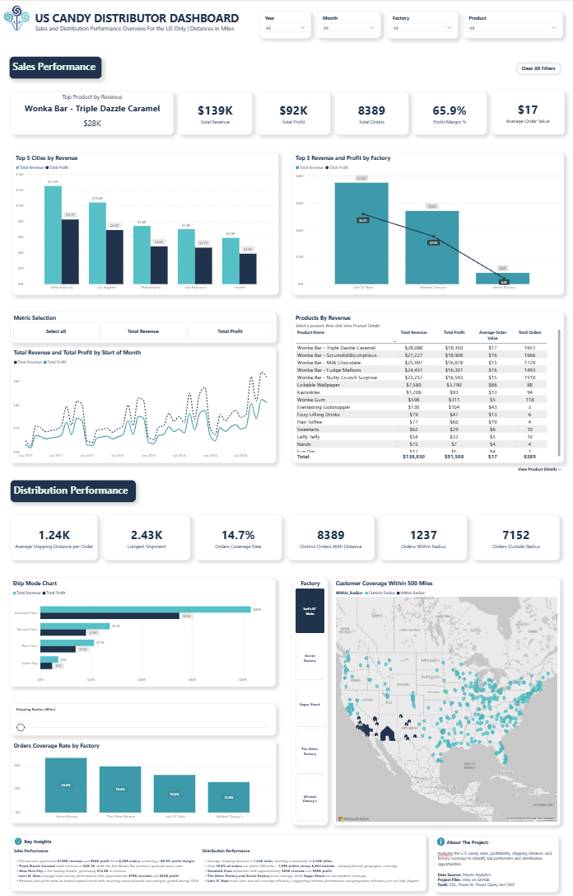

# Supply-Chain-Shipping-Dashboard
Analyzes the U.S. candy sales, profitability, shipping distance, and factory coverage to identify top performers and distribution opportunities.

#### 🚀 Live Dashboard

#### 👉 **[Click here to view the interactive Power BI Dashboard](https://app.powerbi.com/view?r=eyJrIjoiNzViMDA0YzgtY2JlZi00YTExLWFhM2ItM2U2YTRkOWU0YWM5IiwidCI6ImUzMThjNGEzLTQ4YzYtNGEyYS1iNjg1LTE4Yjc0MDFkYmU5MiJ9)**

## 📖 Project Overview

This project is an end-to-end Business Intelligence solution developed in **Power BI** using the **Supply Chain Shipping** dataset provided by **Maven Analytics**.

The report transforms raw shipping and sales data into interactive dashboards that enable stakeholders to monitor sales performance, shipping operations, and product insights. It combines data preparation, data modeling, DAX calculations, and interactive visualizations to support data-driven business decisions and improve operational efficiency.

## 🎯 Business Background

<strong>1. Company Overview</strong>

 

A national U.S. candy distributor manages product sales and shipments from multiple factories to customers across different geographic markets. The company tracks customer and factory locations, sales orders, product details, and divisional targets.

 

<strong>2. Business Context</strong>

 

This project analyzes both **commercial performance** and **distribution efficiency** using sales transactions combined with factory and customer geographic data. The analysis evaluates profitability, shipping routes, product performance, and factory allocation to provide insights that support operational and strategic decision-making.

Although the dataset includes a small number of **Canadian** orders, the vast majority of transactions occur within the **United States**. To maintain a focused and representative analysis, this project concentrates exclusively on U.S. operations.

 

<strong>3. Business Problem</strong>

 

The company lacks a centralized view of sales and distribution performance, making it difficult to answer key business questions such as:

- Which products and factories generate the highest revenue and profit?
- How does sales performance vary across products and over time?
- Which factories provide the most efficient customer coverage?
- Are customers being served within the company's target shipping distance?
- Which factory locations present opportunities to improve distribution efficiency?

 

<strong>4. Business Goals</strong>

 

Build an interactive Power BI solution that helps the company:

- Monitor sales performance through revenue, profit, profit margin, and order metrics.
- Compare sales performance across products, factories, and time.
- Evaluate factory-to-customer shipping distances and customer coverage.
- Identify opportunities to improve distribution efficiency by highlighting long shipping routes and low coverage areas.
- Analyze product profitability to identify top- and bottom-performing products.
- Support data-driven decisions for sales performance and distribution planning.

## 🛠 Project Workflow

<strong>1. Business Understanding</strong>

#### Stakeholder Analysis

The first step of the project was to identify the key stakeholders and understand how the dashboard could support their business decisions. This ensured the reporting solution addressed both commercial performance and distribution efficiency across the U.S. distribution network.

| Stakeholder | Business Need | Decisions Supported |
|--------------|---------------|---------------------|
| **Executive Leadership** | Monitor overall sales, profitability, and distribution performance through high-level KPIs | Strategic planning, business growth, and operational performance monitoring |
| **Sales Managers** | Track revenue, profit, orders, and product performance across time and factories | Product prioritization, sales planning, and performance improvement |
| **Supply Chain & Logistics Managers** | Evaluate shipping distances, customer coverage, and factory performance | Distribution planning, shipping efficiency improvements, and factory performance evaluation |
| **Operations Managers** | Monitor customer coverage, shipping metrics, and factory utilization | Operational planning, resource allocation, and service coverage improvements |
| **Product Managers** | Analyze product revenue, profitability, and order volume | Product portfolio optimization, pricing decisions, and inventory planning |

> **Outcome:** The dashboard was designed to provide each stakeholder group with relevant KPIs and interactive visualizations, enabling faster, data-driven decisions that improve both sales performance and distribution efficiency.
